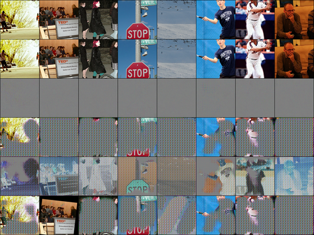
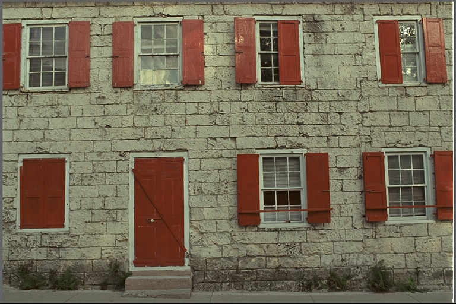
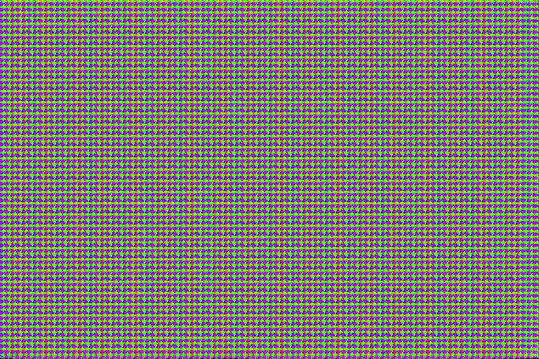
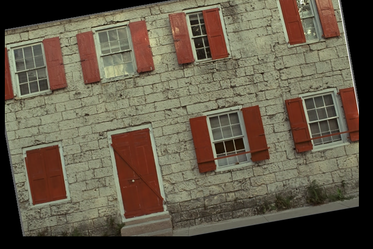
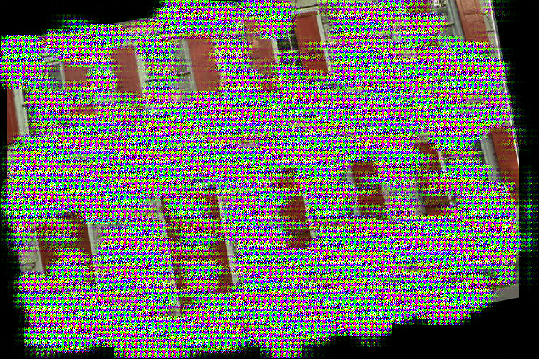

# SLIC

The official pytorch implementation of the paper [A Secure Learned Image Codec for Authenticity Verification via Self-Destructive Compression](https://www.mdpi.com/2504-2289/9/1/14).

## Setup

```
conda env create -f environment.yaml
conda activate SLIC-env
```

### Dataset

Download COCO dataset as training dataset.

```console
wget http://images.cocodataset.org/zips/train2014.zip
wget http://images.cocodataset.org/zips/val2014.zip
```

Put all the 120K images into ``data/COCO``.

Download Kodak dataset as testing dataset.

```console
cd images
./download_kodak.sh
```

### Pre-train Models

#### SLIC Models 

Download below pre-train models and put in the ``models`` folder. 

* [bmshj2018-hyperprior + LPIPS](https://drive.google.com/file/d/1EMSClJifLfV4f9S-m5eyIaQL89Ldj0wR/view?usp=sharing)
* [bmshj2018-hyperprior + DISTS](https://drive.google.com/file/d/1eDgK8zETnbaOJUA5FrXZzgk7hc_qGtQ0/view?usp=sharing)

#### UNetJPEG

Download the pre-trained UNetJPEG model from [here](https://drive.google.com/file/d/1No8-3IQU3v8F_uhLY2jl6bM56Nw14KLF/view?usp=sharing) and save it to ``models/jpegsim_r0.10l0.00010b256_0912-115748-model.pth``.

## Training

### SLIC Models

The neural codecs offered by CompressAI are ``bmshj2018-hyperprior``, ``cheng2020-anchor``, and  ``mbt2018``. You can train your SLIC via:

```bash
# Train the SLIC using hyperprior + LPIPS metric
./train_slic.py --batch_size 12 --train --name slic_hyper_lpips -lr 0.00005 --adv_percep lpips -d data/COCO -r 0.1 -m bmshj2018-hyperprior -q 8 --epochs 100 --noise 'affine((-10,10),(0.1, 0.1),(0.9,1.1))+blur(3,(0.1,1.5))+jpeg(70,90)'
```

During training, you can investigate the quality divergency results in ``logger/RUN_FOLDER/images``:



### UNetJPEG

You can train the UNetJPEG by:

```bash
./jpegsim.py --train --dataset data/COCO -r 0.1
```

## Testing

Generate the first compression result $\hat{x}_1$:

```console
# encode an image to a compressed bitstream (*.bin)
$ ./eval_slic.py --encode -cp models/lpips-bmshj2018-hyperprior-mse-8-best-1216-050701.pth -i images/kodak/kodim01.png
load from given checkpoint models/lpips-bmshj2018-hyperprior-mse-8-best-1216-050701.pth
model: bmshj2018-hyperprior, metric=mse, quality=8
set entropy coder: ans
write to output/kodim01-bmshj2018-hyperprior_C.bin, bpp=2.59

# decode the bitstream to the reconstruction image
$ ./eval_slic.py --decode -i output/kodim01-bmshj2018-hyperprior_C.bin
load from given checkpoint models/lpips-bmshj2018-hyperprior-mse-8-best-1216-050701.pth
model: bmshj2018-hyperprior, metric=mse, quality=8
set entropy coder: ans
save to output/kodim01-bmshj2018-hyperprior_C.png
```

The content of ``kodim01-bmshj2018-hyperprior_C.png`` ($\hat{x}_1$):



Generate the second compression result $\hat{x}_2$:

```console
# re-encode the first compressed image
$ ./eval_slic.py --encode -i output/kodim01-bmshj2018-hyperprior_C.png
load from given checkpoint models/lpips-bmshj2018-hyperprior-mse-8-best-1216-050701.pth
model: bmshj2018-hyperprior, metric=mse, quality=8
set entropy coder: ans
write to output/kodim01-bmshj2018-hyperprior_C-bmshj2018-hyperprior_C.bin, bpp=3.26

# decoding
$ ./eval_slic.py --decode -i output/kodim01-bmshj2018-hyperprior_C-bmshj2018-hyperprior_C.bin
load from given checkpoint models/lpips-bmshj2018-hyperprior-mse-8-best-1216-050701.pth
model: bmshj2018-hyperprior, metric=mse, quality=8
set entropy coder: ans
save to output/kodim01-bmshj2018-hyperprior_C-bmshj2018-hyperprior_C.png
```

The content of ``kodim01-bmshj2018-hyperprior_C-bmshj2018-hyperprior_C.png`` ($\hat{x}_2$):



Apply image editings (affine transform) on $\hat{x}_1$ as noised reconstruction image $\hat{x}_1'$:

```console
$ ./img_edit.py --affine -i output/kodim01-bmshj2018-hyperprior_C.png -o output/kodim01-affine.png
```



Re-encode the noised reconstruction image $\hat{x}_1'$: 

```console
$ ./eval_slic.py --encode -i output/kodim01-affine.png 
load from given checkpoint models/lpips-bmshj2018-hyperprior-mse-8-best-1216-050701.pth
model: bmshj2018-hyperprior, metric=mse, quality=8
set entropy coder: ans
write to output/kodim01-affine-bmshj2018-hyperprior_C.bin, bpp=2.09

$ ./eval_slic.py --decode -i output/kodim01-affine-bmshj2018-hyperprior_C.bin
load from given checkpoint models/lpips-bmshj2018-hyperprior-mse-8-best-1216-050701.pth
model: bmshj2018-hyperprior, metric=mse, quality=8
set entropy coder: ans
save to output/kodim01-affine-bmshj2018-hyperprior_C.png
```

The re-compression result as $\hat{x}_2'$:



# Citation

If you find this work useful for your research, please cite:

```
@Article{bdcc9010014,
	AUTHOR = {Huang, Chen-Hsiu and Wu, Ja-Ling},
	TITLE = {A Secure Learned Image Codec for Authenticity Verification via Self-Destructive Compression},
	JOURNAL = {Big Data and Cognitive Computing},
	VOLUME = {9},
	YEAR = {2025},
	NUMBER = {1},
	ARTICLE-NUMBER = {14},
	URL = {https://www.mdpi.com/2504-2289/9/1/14},
	ISSN = {2504-2289},
	DOI = {10.3390/bdcc9010014}
}
```
